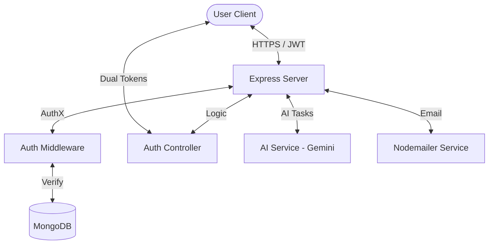

# 🛡️ DevPrep AI - AuthX Suite
> **Elite Technical Mastery & Enterprise-Grade Security**

[](https://github.com/SailokeshNalabothu/devprep-ai)
[](https://nodejs.org/)
[](https://react.dev/)

DevPrep AI is a high-performance, professional coding mastery platform architected for developers who demand elite-tier technical preparation. Now powered by the **AuthX Security Suite**, it combines advanced AI logic diagnostics with enterprise-grade session management and a stunning, student-friendly interface.

---

## 💎 Features at a Glance

### 🔐 AuthX - Enterprise Security
- **Dual-Token JWT Architecture**: Short-lived access tokens paired with long-lived refresh tokens for maximum security and seamless silent refreshing.
- **SSO Integration**: Smooth Google OAuth 2.0 and GitHub sign-in workflows.
- **OTP Verification**: Secure 6-digit email codes (via Nodemailer) required for account initialization.
- **Bcrypt Hashing**: Industry-standard password encryption for all local accounts.

### 🤖 AI-Core Mastery
- **AI Practice Interview**: Engage with a Senior Engineer agent optimized for Tier-1 technical and behavioral scenarios.
- **Logic Explainer**: Not just "what" but "why" your code works, with deep-trace logic analysis.
- **Bug Fix Mode**: Specialized training for identifying and resolving complex logic errors.

### 🏛️ Site Settings & Governance
- **General Settings**: Toggle registrations, enforce maintenance mode, and manage global email verification policies.
- **User Hub**: Comprehensive dashboard to see who is using the site and manage access levels.

### 🎓 Student-Friendly UX
- **Simplified Language**: Complex technical jargon (SaaS/AI terms) replaced with clear, meaningful words accessible to everyone from high school students to senior engineers.

---

## 🛠️ Tech Stack

- **Core**: Node.js (Express 5), React 19, MongoDB (Mongoose)
- **UI Architecture**: Tailwind CSS (Glassmorphism), Framer Motion, Lucide icons
- **Security Logic**: Passport.js, JWT, Axios Interceptors, Express-Rate-Limit
- **AI Service**: Google Gemini (v1beta) for high-speed logic evaluation

---

## 🚀 Professional Setup

### 1. Repository Initialization
```bash
git clone https://github.com/SailokeshNalabothu/devprep-ai.git
cd devprep-ai
```

### 2. Backend Configuration (AuthX)
Navigate to `backend/` and install dependencies:
```bash
npm install
```
Configure your `.env` for full AuthX functionality:
```env
MONGODB_URI=mongodb://127.0.0.1:27017/devprepAI
JWT_SECRET=your_generated_secret
REFRESH_TOKEN_SECRET=your_generated_refresh_secret
EMAIL_USER=your_gmail_address
EMAIL_PASS=your_gmail_app_password
GOOGLE_CLIENT_ID=your_google_id
GOOGLE_CLIENT_SECRET=your_google_secret
```

### 3. Frontend Initialization
Navigate to `frontend/` and install dependencies:
```bash
npm install
npm start
```

---

## 🏗️ Technical Architecture & Ecosystem

DevPrep AI follows a strict **Modular Monolith** architecture with a clear separation of concerns, optimized for asynchronous AI processing and high-security authentication.

### 🗺️ System Overview (High-Level)


---

### 🔑 AuthX Security Protocol (Lifecycle)
The **AuthX Suite** implements a persistent session strategy designed for both security and user convenience:

1.  **Registration Phase**:
    -   User provides credentials $\rightarrow$ Password hashed via **Bcrypt** (Salt: 10).
    -   System generates a **6-digit OTP** $\rightarrow$ Saved to DB with a 10-minute TTL.
    -   **Nodemailer** dispatches the code to the user's verified address.
2.  **Verification & Token Issuance**:
    -   Valid OTP $\rightarrow$ Account marked `isVerified: true`.
    -   Server issues a **Short-lived Access Token** (15m) and a **Long-lived Refresh Token** (7d).
    -   Refresh Token is stored in the DB (for revocation) and returned to the client.
3.  **Silent Refresh Flow**:
    -   Frontend **Axios Interceptor** detects 401 (Expired).
    -   Client calls `/api/auth/refresh` with the Refresh Token.
    -   Server validates token $\rightarrow$ Issues a fresh Access Token $\rightarrow$ Transparent UX.

---

### 🤖 AI Orchestration Layer
The **AIService** acts as a bridge between user code and the **Google Gemini 2.5-Flash** model:

-   **Context Injection**: System prompts are dynamically injected with problem constraints and user solutions.
-   **Structured Parsing**: Results are parsed from raw model output into validated JSON for consistent UI rendering.
-   **Fallback Mechanics**: Integrated try-catch logic with maintenance mode detection to handle API rate limits gracefully.

---

### 📂 Database Modeling (Core Schemas)

#### **User Model** (`models/User.js`)
| Field | Type | Purpose |
| :--- | :--- | :--- |
| `name`, `email` | String | Identity & Authentication |
| `password` | Hash | Encrypted Credential |
| `role` | Enum | `user` / `admin` access control |
| `isVerified` | Boolean | Account status (OTP result) |
| `refreshToken`| String | Session persistence token |
| `googleId` | String | SSO Identifier (OAuth 2.0) |

#### **Question Model** (`models/Question.js`)
| Field | Type | Purpose |
| :--- | :--- | :--- |
| `title`, `description` | String | Content metadata |
| `difficulty` | Enum | Easy / Medium / Hard categorization |
| `testCases` | Array | Automated code verification data |
| `companies` | Array | Career-path targeting |

---

### 🛡️ Admin Governance Layer
A centralized control system accessible via the **Site Settings** dashboard:

-   **Public Registrations**: Toggle `allowSignup` to close the platform during private cohorts.
-   **Maintenance Mode**: Global flag to intercept all non-admin requests with a "Pardon our Dust" notice.
-   **Require Email Check**: Enforce or skip OTP verification based on current security requirements.

---


**Developed for Excellence by the DevPrep AI Team.**


