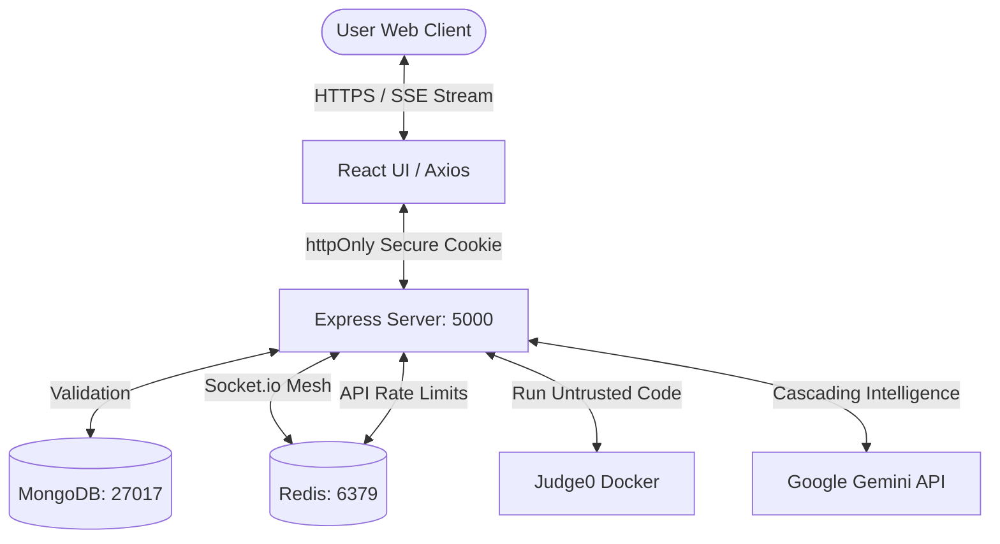

# 🛡️ DevPrep AI - AuthX Suite
> **Elite Technical Mastery & Enterprise-Grade Security for Software Engineers**

[](https://github.com/SailokeshNalabothu/devprep-ai)
[](https://nodejs.org/)
[](https://react.dev/)
[](https://docker.com)
[](https://redis.io/)

DevPrep AI is a high-performance, professional coding mastery platform architected for developers who demand elite-tier technical preparation. Designed to comfortably handle **1 Million Users**, it combines advanced AI logic diagnostics, enterprise-grade Dockerized infrastructure, and a stunning, responsive React interface.

---

## 💎 Features at a Glance

### 🔐 Enterprise AuthX Security (Audit Phase 2 Hardened)
- **IDOR Safeguards**: Active verification of document ownership in MongoDB for mock interview steps and solutions synchronization.
- **CSRF Defense Headers**: Origin and Referer validation middleware checking for authorized headers on all mutation requests.
- **Secure GitHub Linking**: Encrypted random states stored in secure HTTP-only cookies (`github_state` and `github_user_id`) to block CSRF exploits on OAuth linking.
- **At-Rest Token Encryption**: Private third-party OAuth access tokens are encrypted inside MongoDB using AES-256-CBC with legacy plaintext fallback support.
- **Dual-Token JWT Architecture**: Short-lived Access Tokens paired with robust Refresh Tokens stored securely in `httpOnly` cookies to strictly prevent XSS.
- **OTP Verification**: Secure 6-digit email codes (via Nodemailer HTML templates) required for account initialization.
- **Platform Governance**: Admin dashboard toggles to restrict signup, force maintenance mode, or suspend accounts.

### 🤖 AI-Core Mastery
- **AI Practice Interview**: Engage with a Senior Engineer agent optimized for real-time WebSocket typing synchronization and conversational code evaluation.
- **Logic Explainer**: AI deeply traces uploaded code lines to explain "why" your code works, targeting Python/JS/C++ seamlessly.
- **Bug Fix Mode**: Hunt down subtle syntactic issues in a Monaco editor with AI validating your "Fixed" attempts.
- **System Design Architect**: Text-based mock System Design interviews that evaluate scalability constraints (e.g., Load Balancers, Redis, MongoDB).

### 🚀 Deep Platform Optimizations
- **Apple UI Dark Mode Redesign**: Complete aesthetic reskin to a premium glassmorphic dark theme (`bg-[#090a0f]` and `bg-[#18181b]/60` cards) across Login, Signup, OTP, Dashboard, Lessons list, Profile, Leaderboard, Submissions list, and Admin modules.
- **No-Scrolling viewports (100% Zoom)**: Re-designed layouts, compacted card spacings, and responsive sidebar scrollbars ensuring the entire interface fits comfortably on standard browser heights without cutoffs.
- **Code Execution Sandbox**: A locally hosted `Judge0` Docker environment automatically catches and destroys malicious code payloads (`rm -rf /`) safely.
- **React Lazy Loading**: Heavy Monaco boundaries and AI layout trees are chunked via `React.lazy()` for instantaneous dashboard paint times.
- **MongoDB Compound Indexing**: Schemas mapped with `{ userId: 1, questionId: 1 }` ensuring mathematically `O(1)` constant-time lookups across millions of submissions.
- **Redis Multi-Node Syncing**: Socket.io initialized with `@socket.io/redis-adapter` allowing limitless Node.js instances to sync mock-interview chat packets globally.

---

## 🛠️ Tech Stack

- **Core**: Node.js (Express 5), React 19, MongoDB (Mongoose), Redis
- **Security Logic**: Passport.js, JWT, AES-256-CBC, Express-Rate-Limit (100 reqs/15m)
- **Infrastructure**: Local `docker-compose` Sandbox architectures
- **UI Architecture**: Tailwind CSS (Glassmorphism), Framer Motion, Monaco Editor, Lucide
- **AI Service**: Google Gemini (Cascading Fallback: `2.5-flash` $\rightarrow$ `2.5-pro` $\rightarrow$ `flash-latest`)

---

## 🚀 Professional Setup Guide

### 1. Repository Initialization
```bash
git clone https://github.com/SailokeshNalabothu/devprep-ai.git
cd devprep-ai
```

### 2. Infrastructure Boot (Docker)
Ensure Docker Desktop is running, then launch the infrastructure dependencies:
```bash
# Spins up Redis and the optional Judge0 Execution Sandbox
docker-compose up -d
```

### 3. Backend Configuration (AuthX & AI)
Navigate to `backend/` and install dependencies:
```bash
cd backend
npm install
```
Configure your `.env` for full functionality (AuthX, Gemini, SMTP, Redis):
```env
MONGODB_URI=mongodb://127.0.0.1:27017/devprepAI
JWT_SECRET=your_secret_hash
REFRESH_TOKEN_SECRET=your_refresh_secret
EMAIL_USER=your_gmail_address
EMAIL_PASS=your_gmail_app_password
GOOGLE_CLIENT_ID=your_google_id
GOOGLE_CLIENT_SECRET=your_google_secret
GOOGLE_CALLBACK_URL=http://localhost:5000/api/auth/google/callback
REDIS_URL=redis://127.0.0.1:6379
GEMINI_API_KEY=your_gemini_api_key_here
```
Boot the backend server:
```bash
npm run dev
```

### 4. Frontend Initialization
In a new terminal window, load the client interface:
```bash
cd frontend
npm install
npm start
```
Navigate to `http://localhost:3000` to begin.

---

## 🏗️ Technical Architecture Topology

DevPrep AI follows a strict **Modular Monolith** architecture with a clear separation of concerns, heavily optimized for asynchronous AI processing and multi-tiered security rendering.



---

## 🚀 Core Achievements & Security Upgrades

### 🔒 Enterprise Security Audits
1. **Single-Admin Privilege Constraint:** Centralized the administrative access control middleware (`admin.js`) to strictly block anyone except `sailokeshnalabothu@gmail.com` with the `admin` role from managing site configurations, user roles, or question contents.
2. **Automated Security Pipelines (CI/CD):** Designed a GitHub Actions runner workflow (`security.yml`) checking middleware origin defenses against simulated CSRF requests.
3. **User Management Endpoint Repair:** Resolved an endpoint mismatch where the frontend role editor was hitting a non-existent `PATCH` endpoint, redirecting it to the correct `PUT /api/users/:id/role` controller route.
4. **Broken Object-Level Authorization (IDOR):** Guarded routes `syncSubmissionToGithub`, `handleTurn`, and `completeInterview` to ensure users cannot query, modify, or sync other users' sessions.
5. **Linked Account Forgery (OAuth CSRF):** Enforced a randomized secure cookie verification scheme on `/github/callback` redirects to prevent cross-site request forgery when binding social credentials.
6. **Sensitive Data Exposure:** Implemented an AES-256-CBC encryption layer inside `cryptoService.js` to protect GitHub tokens stored in MongoDB with key rotation safeguards.
7. **Cross-Site Request Forgery (CSRF):** Registered a global CSRF origin/referer middleware checking validation hostnames on mutation payloads.

### 🎨 Apple glassmorphism Dark Theme
- Integrated custom dark mode elements (`bg-[#090a0f]`) and transparent card wrappers (`bg-[#18181b]/60 border-white/5`).
- Tightened card vertical space, compacted stats row indicators, and added scroll safety mechanisms to the sidebar navigation list so that pages fit browser heights at 100% zoom perfectly.
- Enabled multi-language editor configurations supporting templates for JavaScript, Python, C++, and Java.

---

## 💡 Future Recommendations & Platform Scalability

To push DevPrep AI to enterprise production limits, we recommend implementing the following components:

1. **Multi-Language Sandbox Compiler:** Extend the Judge0 sandbox middleware to evaluate Rust, Python, Go, and C++ code alongside JavaScript, generating boilerplates inside Monaco.
2. **WebSocket-based Collaborative Mocking:** Integrate Operational Transformation (OT) or Yjs CRDTs on Socket.io so multiple interviewers and candidates can write code synchronously on the same canvas.
3. **Gemini Live Multimodal Voice Feed:** Replace the current Speech Synthesis API voice logic with direct WebRTC streaming linked to the Gemini Multimodal Live API, enabling low-latency real-time voice interviews.
4. **CI/CD Automated Security Scanning:** Hook up Jest/Supertest check suites checking CORS configuration, IDOR ownership flags, and token encryption schemas directly to GitHub Actions pipelines to block potential regressions.

**Built for Excellence by the DevPrep AI Team 💙💙💙.**
